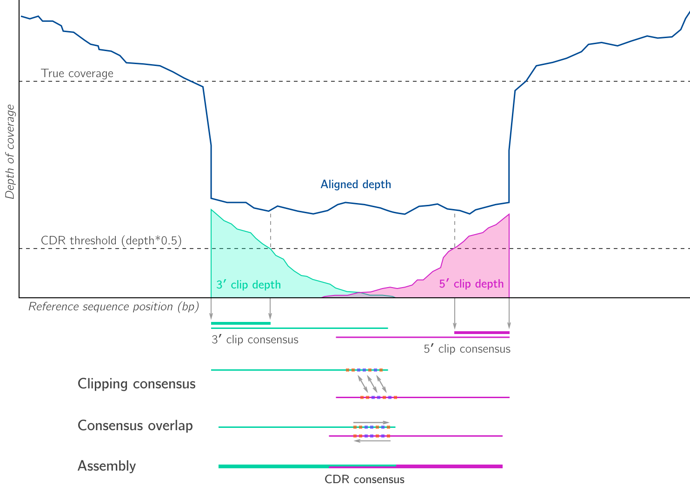
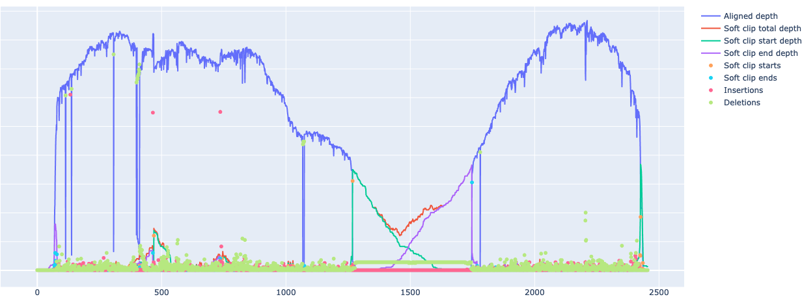
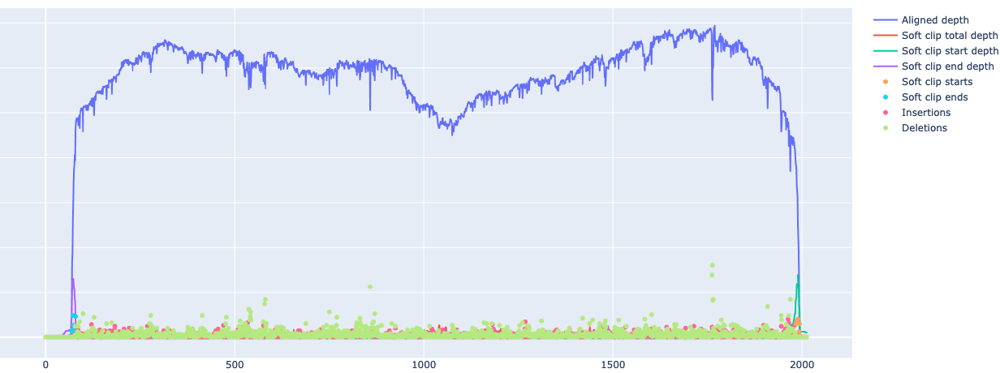

# Kindel: indel-aware consensus from aligned BAM

[](http://joss.theoj.org/papers/117efd1fc35bb2011311f73d3fa0b545) [](https://pypi.org/project/kindel/) []() [](https://github.com/bede/kindel/actions/workflows/test.yml)


Kindel reconciles substitutions and CIGAR-described indels to to produce a majority consensus from an aligned BAM/SAM file. Using the `--realign` option, unaligned gap closure using soft-clipped sequence information is also performed, a kind of local reassembly. Intended for use with small alignments of genes or virus genomes, Kindel is tested with BAMs created by aligners such as Minimap2 and BWA. No reference sequence is required, however the input BAM must contain headers (`@SQ`) . If you encounter problems, please open an issue. Please also cite the [JOSS article](http://joss.theoj.org/papers/117efd1fc35bb2011311f73d3fa0b545) if you find this useful.


### Core functionality


### Reassembly of clip-dominant regions (CDRs) with `--realign`




## Features

- Consensus of aligned substititutions, small insertions and deletions

- Optional consensus reassembly around large unaligned 'clip-dominant'  gaps (using `--realign`)

- Support for short, paired and long reads mapped with e.g. Minimap2, BWA-MEM, and Segemehl

- Support for BAMs with multiple reference contigs, chromosomes

- Visualisation of aligned and clipped sequence depth by site alongside insertions, deletions (`kindel plot`)

  


## Limitations

- While Kindel has been tested with bacterial genomes, expect slow performance with megabase genomes
- SAM/BAM files must contain an `@SQ` header line with reference sequence length(s).
- Realignment mode (`--realign`) is able to close gaps of up to 2x read length


## Installation

Install inside existing Python environment:

```shell
# Requires Python 3.9+ and Samtools
pip install kindel
```
Complete installation using a conda-compatible package manager:

```
conda create -y -n kindel python=3.13 samtools
conda activate kindel
pip install kindel
```

Development install:

```
git clone https://github.com/bede/kindel.git
cd kindel
pip install --editable '.[dev]'
```


## Usage (`kindel consensus`)

Also see [`usage.ipynb`](usage.ipynb)


### Command line

Generate a consensus sequence from an aligned BAM, saving the consensus sequence to `cns.fa`:

```bash
$ kindel consensus alignment.bam > cns.fa
```


Generate a consensus sequence from an aligned BAM with realignment mode enabled, allowing closure of gaps in the consensus sequence:

```bash
$ kindel consensus --realign alignment.bam > cns.fa
```

Built in help:

```bash
$ kindel -h
usage: kindel [-h] {consensus,weights,features,variants,plot} ...

positional arguments:
  {consensus,weights,features,variants,plot,version}
    consensus           Infer consensus sequence(s) from alignment in SAM/BAM
                        format
    weights             Returns table of per-site nucleotide frequencies and
                        coverage
    features            Returns table of per-site nucleotide frequencies and
                        coverage including indels
    variants            Output variants exceeding specified absolute and
                        relative frequency thresholds
    plot                Plot sitewise soft clipping frequency across reference
                        and genome
    version             Show version

optional arguments:
  -h, --help            show this help message and exit

```

```bash
$  kindel consensus -h
usage: kindel consensus [-h] [-r] [--min-depth MIN_DEPTH]
                        [--min-overlap MIN_OVERLAP] [-c CLIP_DECAY_THRESHOLD]
                        [--mask-ends MASK_ENDS] [-t] [-u]
                        bam_path

Infer consensus sequence(s) from alignment in SAM/BAM format

positional arguments:
  bam_path              path to SAM/BAM file

optional arguments:
  -h, --help            show this help message and exit
  -r, --realign         attempt to reconstruct reference around soft-clip
                        boundaries (default: False)
  --min-depth MIN_DEPTH
                        substitute Ns at coverage depths beneath this value
                        (default: 1)
  --min-overlap MIN_OVERLAP
                        match length required to close soft-clipped gaps
                        (default: 7)
  -c CLIP_DECAY_THRESHOLD, --clip-decay-threshold CLIP_DECAY_THRESHOLD
                        read depth fraction at which to cease clip extension
                        (default: 0.1)
  --mask-ends MASK_ENDS
                        ignore clip dominant positions within n positions of
                        termini (default: 50)
  -t, --trim-ends       trim ambiguous nucleotides (Ns) from sequence ends
                        (default: False)
  -u, --uppercase       close gaps using uppercase alphabet (default: False)
```


### Python API

```python
from kindel import kindel

kindel.bam_to_consensus(bam_path, realign=False, min_depth=2, min_overlap=7,
                        clip_decay_threshold=0.1, trim_ends=False, uppercase=False)
```


## Issues

If you encounter problems please open a GitHub issue, preferably including a BAM that allows the problem to be reproduced, or else reach out via email or social media.


## Visualising alignments (`kindel plot`)

It can be useful to visualise rates of insertion, deletion and alignment clipping across an alignment. `kindel plot` generates an interactive HTML plot showing relevant alignment information.

To plot aligned depth alongside insertion, deletion and soft clipping frequency:

```
kindel plot tests/data_minimap2/2.issue23.debug.bam
```


**Original alignment**


**After alignment to Kindel consensus sequence**



## Contributing

If you would like to contribute to this project, please open an issue or contact the author directly using the details above. Please note that this project is released with a [Contributor Code of Conduct](https://github.com/statsmaths/kerasR/blob/master/CONDUCT.md), and by participating in this project you agree to abide by its terms.

Before opening a pull request, please:

- Ensure tests pass in a local development build (see installation instructions) by executing `pytest` inside the package directory.
- Increment the version number inside `__init__.py` according to [SemVer](http://semver.org/).
- Update documentation and/or tests if possible.