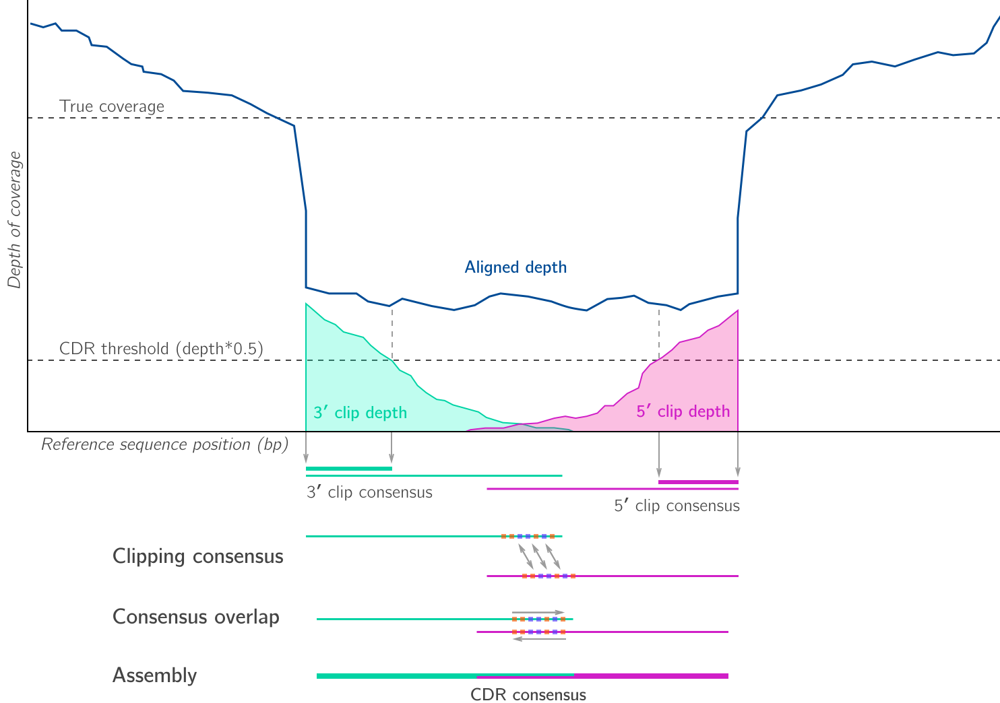

# Summary

Kindel is a collection of tools for inferring consensus sequence from an alignment of nucleotide sequences in Sequence Alignment/Map (SAM) format [1]. Sequence substitutions, insertions and deletions (indels) are represented in the generated consensus where the majority of  sequence information—even that contained within unaligned sequence regions—supports their presence. At regions where reads deviate sufficiently from the reference sequence, unaligned sequence context is used to locally reassemble a consensus. In this way, Kindel generates a data-specific reference sequence that maximises overall read-reference similarity. An elegant streaming consensus approach to consensus inference was implemented in OCOCO [2], but like other approaches it fails to reconcile indels.

Kindel was developed for inferring consensus of highly diverse populations of RNA viruses such as hepatitis C and HIV, and is tested with deep sequenced hepatitis C alignments generated by BWA-MEM [3] and Segemehl [4]. Furthermore, Kindel may be used to quantify and visualise subconsensus variation in allele frequencies across a reference sequence, facilitating comparison of intrapatient population state among multiple individuals and/or timepoints. Kindel is implemented as Python 3 package with a command line interface.

### Core functionality

### Reassembly of clip-dominant regions (CDRs) with `--realign`

# References

[1] **Li H, Handsaker B, Wysoker A, Fennell T, Ruan J, Homer N, Marth G, Abecasis G, Durbin R (2009)**. The Sequence Alignment/Map format and SAMtools. *Bioinformatics* 25 (16): 2078-2079. doi:[10.1093/bioinformatics/btp352](https://doi.org/10.1093/bioinformatics/btp352)

[2] **Břinda L, Boeva V, and Kucherov G (2016)**. Dynamic read mapping and online consensus calling for better variant detection. *ArXiv e-prints, [[arXiv:1605.09070#v1]( [http://arxiv.org/abs/1605.09070](http://arxiv.org/abs/1605.09070))] \[genomics\]*.

[3] **Li H and Durbin R (2009)**. Fast and accurate short read alignment with Burrows–Wheeler transform. *Bioinformatics*, 25 (14):1754–1760. doi:[10.1093/bioinformatics/btp324](https://doi.org/10.1093/bioinformatics/btp324)

[4] **Otto C, Stadler P F, Hoffmann S (2014).** Lacking alignments? The next-generation sequencing mapper segemehl revisited. *Bioinformatics* 30 (13): 1837-1843. doi: [10.1093/bioinformatics/btu146](https://doi.org/10.1093/bioinformatics/btu146)

